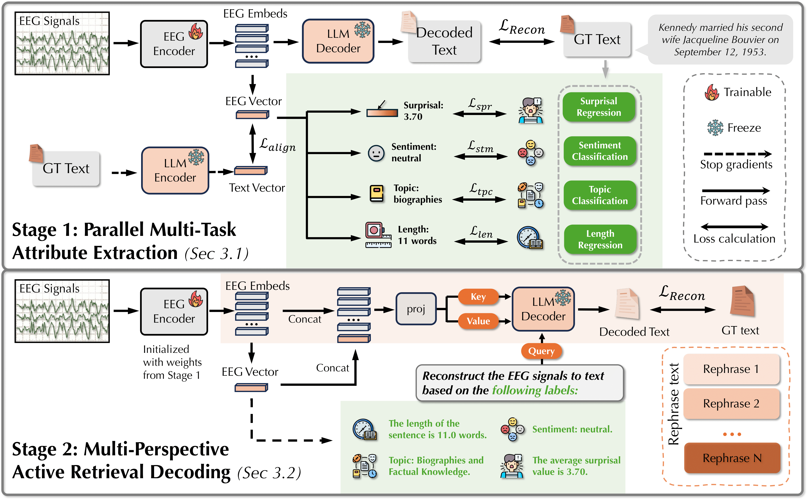

# Task-Aware EEG-to-Text: A Controlled Retrieval Study on ZuCo

A controlled study of **EEG-to-text retrieval** on ZuCo, built on the frozen GLIM representation and the SemKey framework. The emphasis is measurement — what survives when the evaluation is tightened — rather than a new decoder.

## 📌 Overview

This project makes three joined contributions (working manuscript under `notes/03_manuscript/`):

1. **A controlled retrieval audit.** Candidate-pool composition can inflate a released system's apparent retrieval: matching distractors by dataset and reading task removes about 95% of its above-chance Top-1 margin, and sentence length adds nothing.
2. **EEG-specific pooled retrieval, plus a task-segmentation null.** A purpose-trained contrastive adapter over the frozen pooled GLIM representation reaches macro MRR ≈ 0.32 (analytic chance 0.157), while task/subject/length-matched wrong-real EEG stays at chance — retrieval that is genuinely EEG-specific. Yet segmenting the contrastive objective by *true* reading task adds no measurable advantage over global mixed-task or size-matched pseudo-task training (a preregistered null).
3. **A pooled-versus-token diagnostic (in progress).** ColBERT-style MaxSim late interaction over GLIM's unpooled 96 tokens, capacity-matched to the pooled arm, testing whether finer alignment adds retrieval value *beyond* the already-strong pooled baseline.

Every quantitative claim is bound to a hash-verified artifact under a preregistered, matched-control protocol (explicit chance, matched candidate pools, matched-wrong-real-EEG substitution, sentence-grouped cross-fitting, clustered inference); the held-out test partition stays sealed.

**Status.** Gate 2 is closed — the token substrate is extracted and identity-verified, and the pooled-vs-token protocol is frozen (`notes/02_workstreams/token_level_retrieval/`). Gate 3 (the pooled-vs-token training campaign) is built and unit-tested locally; the Kaggle run is the remaining piece.

## 🗂 Repository layout

| Path | Contents |
|---|---|
| `evaluation/` | retrieval + decision harness: GLIM token/vector extractors, the cross-fitted trainer, clustered bootstrap, and decision rules |
| `project_adapters/` | rank-96 residual adapters (pooled cosine + token MaxSim) over the frozen GLIM representation |
| `kaggle/` | pinned-commit Kaggle notebooks (extraction, identity checks) — see [`kaggle/README.md`](kaggle/README.md) |
| `notes/` | working manuscript, decision log, and the frozen protocol locks |

## 🔗 Built on

This work reuses the frozen **GLIM** EEG representation and the **SemKey** framework as components (they are not retrained end-to-end here). SemKey's own setup and training instructions are retained below.

---

# Upstream framework: <span style="font-variant: small-caps;">SemKey</span>

<div align="center">



*Architecture of the <span style="font-variant: small-caps;">SemKey</span> framework*

</div>

<span style="font-variant: small-caps;">SemKey</span> a novel multi-stage framework that enforces signal-grounded generation through four decoupled semantic objectives: sentiment, topic, length, and surprisal. By utilizing these semantic attributes in conjunction with encoded EEG signals, we achieve state-of-the-art (SOTA) performance in EEG-to-text generation.

## 🛠️ Installation & Setup

### 🖥️ Environment Setup

> [!TIP]
> You can find all required packages in `./environment.yml`

```bash
# Create environment
conda env create -f environment.yml
# Activate environment
conda activate semkey
```

```bash
# Additionally, removal of environment
conda env remove -n semkey
```

### 📊 Data Preparation

#### 1.Download ZuCo Dataset

Please download ZuCo 1.0 and 2.0 from their official site:

> ZuCo1: [link](https://osf.io/q3zws/) \
> ZuCo2: [link](https://osf.io/2urht/)

> [!IMPORTANT]
> Please **rename ZuCo2** directories (follows ZuCo1 task naming): \
> "task1 - NR" -> "task2-NR" \
> "task2 - TSR" -> "task3-TSR"
>
> Please also **remove extra spaces** in directories' names (i.e. "task1- SR" -> "task1-SR") and rename "Matlab files" -> "Matlab_files"
>
> Please manually check csv errors in **ZuCo1/task_materials/*.csv** and put them in **ZuCo1/revised_csv** or copy the provided folder from `./preprocess/resource/revised_csv`

Please place necessary files under the following tree structure:
```bash
SemKey
└── datasets
    └── ZuCo
        ├── ZuCo1
        │    ├── revised_csv
        │    ├── task1-SR
        │    ├── task2-NR
        │    └── task3-TSR
        └── ZuCo2
             ├── task_materials
             ├── task2-NR
             └── task3-TSR
...
```

#### 2.Preprocess
Please run the followings as instructed to setup datasets for SemKey stage 1 (parallel) training

> [!TIP]
> Please run from project's root directory (i.e. SemKey/ )

> **Parse ZuCo sentences** \
> Run `./preprocess/preprocess_label.py`

> **Generate topic/sentiment/length/surprisal labels** \
> Run `./label_generation/generate_all_labels.py`

> **Load EEG data** \
> Run `./preprocess/preprocess_mat.py`

> **Merge EEG with labels** \
> Run `./preprocess/preprocess_merge.py`

> **Merge MTV** \
> Copy `./preprocess/resource/zuco_label_8variants.df` to `./data/zuco_preprocessed_dataframe` \
> Run `./preprocess/preprocess_merge_MTV.py`

### 🔄 Upgrade package: `Transformers`
Please run (This upgrade brings cosine learn-rate generation function) \
*If you directly use this version, you'll encounter safetensor warning during label generation*

```bash
pip install --upgrade transformers==4.57.6
```

## 🔥 Training

> [!TIP]
> Please run from project's root directory (i.e. SemKey/ )

### Stage 1 (Semkey Parallel)

> Configure `./run_script/run_parallel.sh` \
> Run `./run_script/run_parallel.sh`

### Prepare data for Stage 2

> Configure `./inference/predict_semkey_parallel_and_pack.sh` \
>     -> You need to specify path-to-stage1 (SemKey parallel) checkpoint \
> Run `./inference/predict_semkey_parallel_and_pack.sh`

### Stage 2 (Semkey E2E | end-to-end training)

> Configure `./run_script/run_e2e.sh` \
>     -> You need to specify path-to-stage1 (SemKey parallel) checkpoint \
>     -> You need to specify path-to-stage2dataset (generated by `./inference/predict_semkey_parallel_and_pack.sh`) \
> Run `./run_script/run_e2e.sh`

## 📈 Evaluation
> [!TIP]
> Please run from project's root directory (i.e. SemKey/ )

Configure `./run_script/run_evaluation_csv.sh`

> `CSV_FILE_PATH`: path to the generated csv file when training the SemKey End-to-End (SemKey E2E) model

Run `./run_script/run_evaluation_csv.sh`

> [!TIP]
> The results will be saved next to the csv file path (in json).